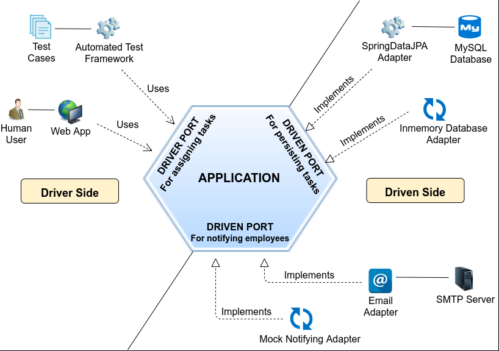
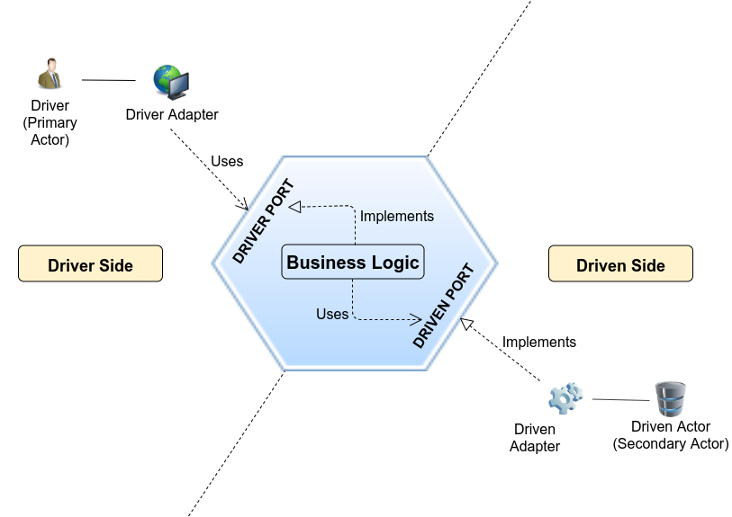

# Hexagonal Architecture

The goal of the Hexagonal architecture, also known as Port & Adapter is to isolate the core of the application from the other systems.

## Inside vs Outside

Once identified, the outside systems are divided in two categories:
- Driver: that needs our application to work
- Driven: that we need for our application to work

The rest of the code is the application itself, the inside part of the hexagon

## Ports & Adapter
### Ports 
The application contains the description of the needed services. Those descriptions are the ports

### Adapters
For the Driver, it will be the use of the ports that we can call.
For the Driven, it will be the implementation of the needed service



Source: [Hexagonal me](https://jmgarridopaz.github.io/)

## Implementation

### Package organization

A package organization of this architecture can be
```
<src>
  | <module name>
     | domain classes (organized as you want) 
     | adapter
        | in
        | out
     | ports
        | in
        | out
     
```

### Dependencies

As a recap of the whole dependencies:
- The Driver side uses the application logic
- The application implements the provided use cases
- The Driven side implements the services needed by the application



Source: [Hexagonal me](https://jmgarridopaz.github.io/)

# Kata
## Goal

Implement the port & adapter aka hexagonal architecture for a simple use case.

This is a quite guided tour on how to setup it.

# Steps

- [Step 1 - Implement the hexagon](./step-1-hexagon.md)
- [Step 2 - Add a creation use case](./step-2-new-use-case.md)
- [Step 3 - Inter module communication](./step-3-inter-module-communication.md)
